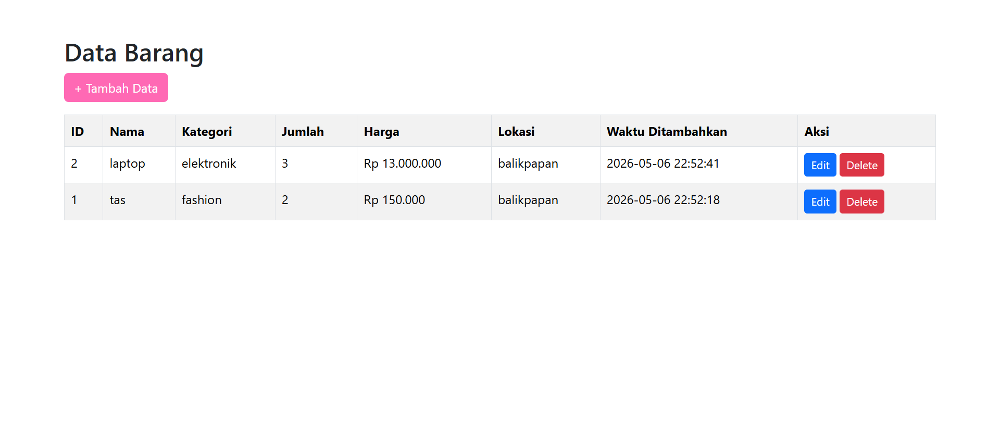
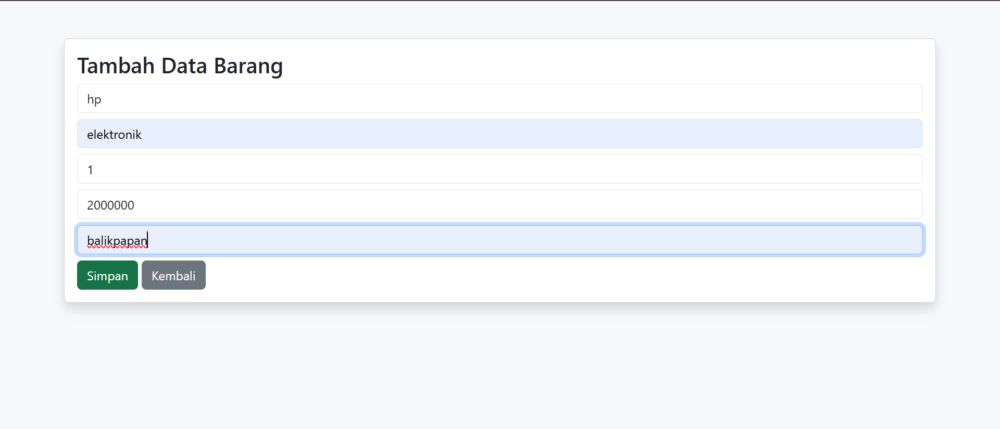
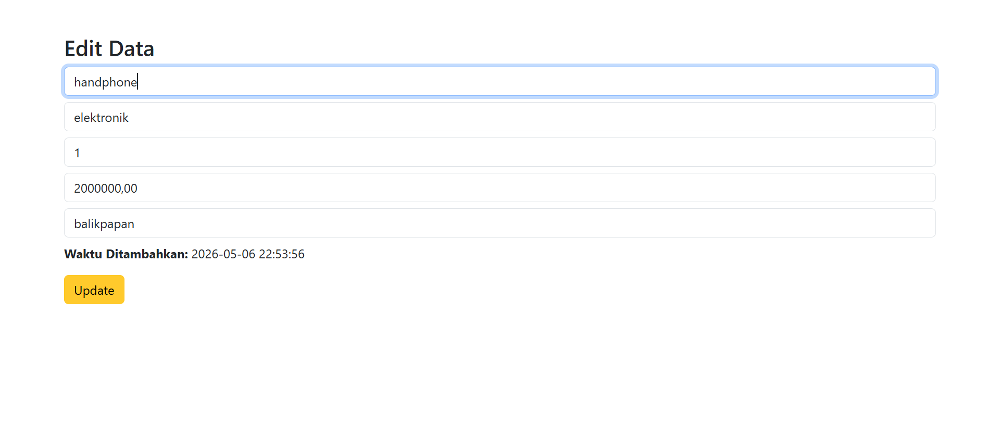
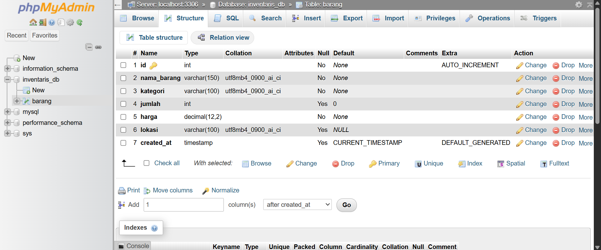

# T4-week10 - Aplikasi CRUD PHP MySQL

Nama    : Sabrina Mawadathun Salsabila
NIM     : F1D02410092
Kelas   : C

## Deskripsi
Aplikasi ini merupakan sistem informasi berbasis web sederhana yang digunakan untuk mencatat, mengelola, dan memantau data barang dalam inventaris. Sistem ini dibangun menggunakan konsep CRUD (Create, Read, Update, Delete) dengan teknologi PHP, MySQL, dan Bootstrap.

# Cara Menjalankan
1. Import file database .sql ke phpMyAdmin
2. Letakkan folder project ke dalam folder www/ pada Laragon (C:\laragon\www\)
3. Jalankan Laragon, lalu klik Start All
4. Buka browser ke http://localhost/T4-week10/index.php

## Screenshot

### Daftar Data
 

### Tambah Data

### Edit Data

### Struktur Database (phpMyAdmin)
